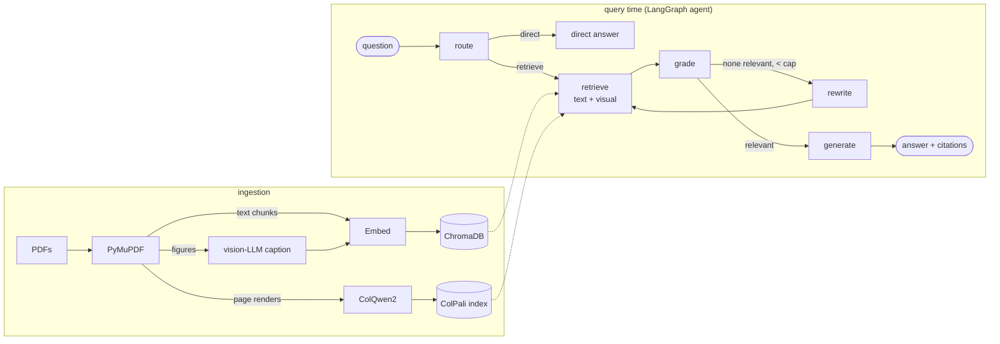

# local-rag

[](https://github.com/ingscarrero/local-rag/actions/workflows/ci.yml)
[](https://github.com/ingscarrero/local-rag/actions/workflows/ci.yml)
[](LICENSE)
[](pyproject.toml)

**Fully-local agentic RAG over PDFs — with hybrid text + visual (ColPali) retrieval.**

Point it at a folder of PDFs. It reads the prose, *looks at* the figures, charts and
tables, and answers questions with citations — using an agent that decides when to
retrieve, grades what it finds, and re-queries when the evidence is weak. **No data
leaves your machine.** Every model runs locally via LM Studio or `llama.cpp`.



## Why this is different from a typical RAG tutorial

- **Local-first, end to end.** LLM, embeddings, and a vision model all run on your
  hardware through an OpenAI-compatible local server (LM Studio or `llama.cpp`).
  Private documents stay private.
- **It actually sees the pages.** Two complementary visual strategies: figures are
  *captioned* by a vision-LLM and embedded as text, **and** whole pages are embedded with
  **ColPali/ColQwen2** late-interaction visual retrieval — which beats OCR pipelines on
  chart/table-heavy documents.
- **Genuinely agentic.** A LangGraph state machine routes, grades retrieved evidence,
  and self-corrects by rewriting the query and retrying (Corrective / Adaptive RAG) — not
  a single `retrieve → stuff → generate` shot.
- **Tested where ML usually isn't.** 125 hermetic unit tests (no model servers, no
  weights) cover the agent graph, every node, both retrievers, and the ingestion
  pipeline — and retrieval tests assert that the *right page wins the ranking*.

## Quickstart

Two interchangeable ways to serve the models — same OpenAI-compatible API, so only
`.env` changes. **LM Studio** (GUI) is the default below; **llama.cpp** (CLI) is the
fully-scripted alternative. Full details in [docs/04-setup.md](docs/04-setup.md).

```bash
# 0. Prereqs: macOS (Apple Silicon recommended), uv
uv sync                       # create .venv and install deps
cp .env.example .env          # set base URLs/model ids for your runtime

# 1a. LM Studio: download a chat, embedding, and vision model, then:
lms server start              # serves all three on :1234, routed by model id
# (or 1b. llama.cpp: ./scripts/serve.sh — chat :8080, embeddings :8081, vision :8082)

# 2. Add PDFs and ingest
cp ~/papers/*.pdf data/
uv run local-rag ingest

# 3. Ask
uv run local-rag ask "What does Figure 1 show about throughput vs. batch size?"
uv run local-rag status
```

With LM Studio, stop the server from the app (or `lms server stop`); with llama.cpp,
`./scripts/stop.sh`. Every command and flag is in
[docs/07-cli-reference.md](docs/07-cli-reference.md).

## Documentation

| Doc | What it answers |
|-----|-----------------|
| [00 — Requirements](docs/00-requirements.md) | What it must do (FR-1…), and how fast / how big / how safe (NFRs) |
| [01 — Concepts](docs/01-concepts.md) | What agentic RAG is and the patterns it uses |
| [02 — Methodology](docs/02-methodology.md) | How those patterns map onto this build |
| [03 — Architecture](docs/03-architecture.md) | What it is: containers, data flow, the agent graph (Mermaid) |
| [04 — Setup](docs/04-setup.md) | Detailed setup, model choices, troubleshooting |
| [05 — Interview prep](docs/05-interview-prep.md) | Q&A, tradeoffs, limitations, demo script |
| [06 — System design](docs/06-system-design.md) | Why it is this way: goals, constraints, rejected alternatives, capacity, failure modes |
| [07 — CLI reference](docs/07-cli-reference.md) | `ingest` / `ask` / `status`, every flag and env var |
| [ADRs](docs/adr/README.md) | Five decision records: ColPali, three servers, ChromaDB, LangGraph, the transformers pin |
| [Runbooks](docs/runbook-lm-studio.md) | Day-2 operations for [LM Studio](docs/runbook-lm-studio.md) and [llama.cpp](docs/runbook-llama-cpp.md) |
| [Write-up](docs/medium-article.md) | The article, with real output and a debugging war story |

Also: [CHANGELOG](CHANGELOG.md) · [CONTRIBUTING](CONTRIBUTING.md) · [SECURITY](SECURITY.md)

## Stack

| Concern            | Choice                                              |
|--------------------|-----------------------------------------------------|
| Model runtime      | LM Studio **or** `llama.cpp` (both OpenAI-compatible) |
| Chat / reasoning   | any local instruct model — e.g. Ministral-3-14B / Qwen2.5-7B |
| Text embeddings    | nomic-embed-text-v1.5                               |
| Figure captioning  | any local VLM — e.g. GLM-4.6V-Flash / Qwen2.5-VL    |
| Visual retrieval   | ColQwen2 via `colpali-engine` (Apple Silicon MPS)   |
| Vector DB          | ChromaDB (local, persistent)                        |
| Agent orchestration| LangGraph                                           |

## Development

```bash
uv sync --extra dev
uv run ruff check . && uv run ruff format --check .
uv run mypy src/local_rag --ignore-missing-imports
uv run pytest            # 125 tests, ~3 s, no models; coverage floor 95%
```

CI runs exactly these and publishes `coverage.xml` as an artifact. See
[CONTRIBUTING.md](CONTRIBUTING.md).

## License

[MIT](LICENSE) © 2026 Sergio Carrero
