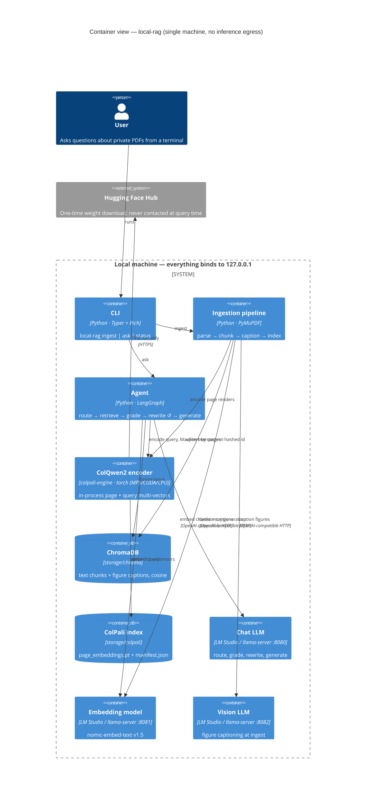
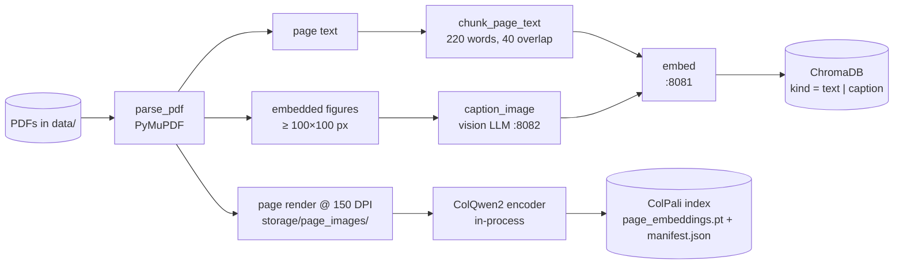
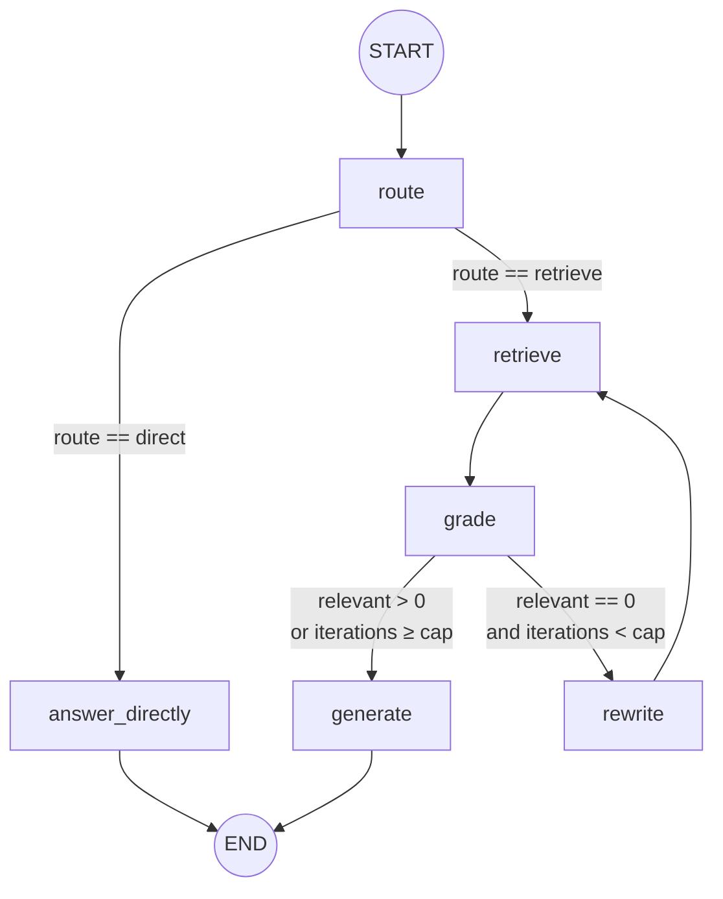
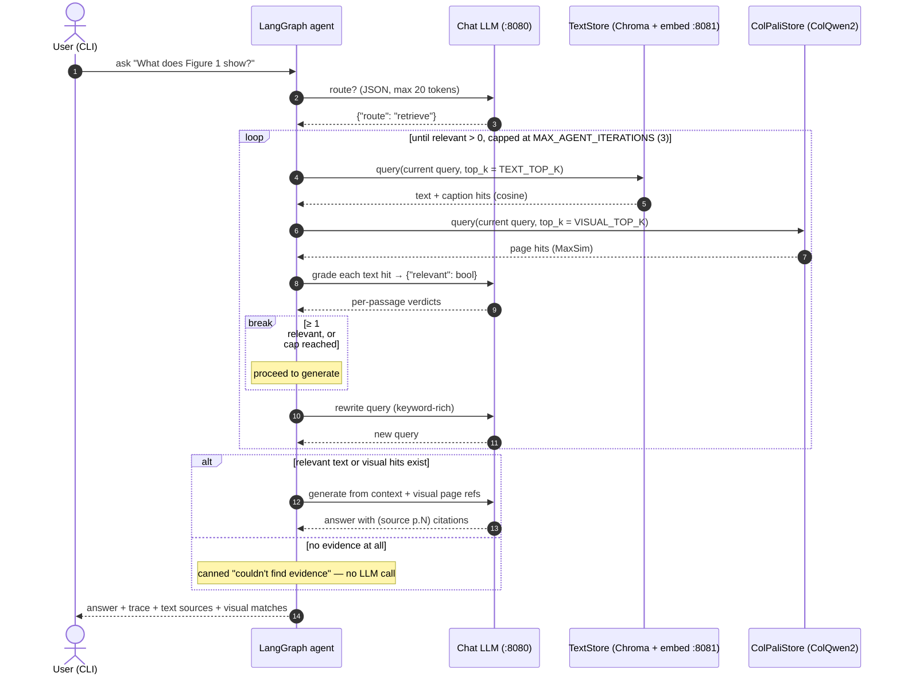

# 03 — Architecture

## System overview

Everything below runs on one machine. The three model servers bind to
`127.0.0.1`; the only outbound connection is the one-time model download.



### Ingestion data flow

One `parse_pdf` pass yields three artefacts per page; two of them end up in
ChromaDB (as text), the third in the ColPali index (as pixels).



## Component map (code)

| Layer | Module | Responsibility |
|-------|--------|----------------|
| Config | `config.py` | env-driven settings, storage paths |
| Model clients | `models.py` | chat / embed / caption via OpenAI-compatible API |
| Parsing | `ingest/pdf.py` | text, embedded images, page renders (PyMuPDF) |
| Chunking | `ingest/chunk.py` | word-window chunks with overlap |
| Pipeline | `ingest/pipeline.py` | orchestrates parse → caption → index |
| Text index | `retrieval/text_store.py` | ChromaDB wrapper (text + captions) |
| Visual index | `retrieval/colpali_store.py` | ColQwen2 embeddings + MaxSim search |
| Fusion | `retrieval/hybrid.py` | run both retrievers together |
| Agent state | `agent/state.py` | typed `AgentState` shared across nodes |
| Agent nodes | `agent/nodes.py` | route / retrieve / grade / rewrite / generate |
| Agent graph | `agent/graph.py` | LangGraph `StateGraph` wiring |
| CLI | `cli.py` | `ingest`, `ask`, `status` |

## Why three separate model servers?

`llama-server` serves one model per process. Running chat, embeddings, and vision
as **three processes** (ports 8080/8081/8082) means each model loads once and stays
warm — no reload cost between an embedding call and a chat call. They're all behind
the same OpenAI-compatible API, so the client code (`models.py`) is uniform and
could point at OpenAI, LM Studio, or vLLM by changing only the base URLs. With
512 GB of unified memory, holding all three resident simultaneously is trivial.

## Data model

**ChromaDB collection `documents`** — one row per text chunk *or* figure caption:

```
id        = "{doc_id}::text::{i}"   |  "{doc_id}::caption::{image_id}"
document  = chunk text              |  "[Figure on page N] <caption>"
metadata  = {kind, doc_id, source, page_number, [image_id]}
embedding = local text-embedding model (768-d, cosine)
```

`doc_id` is content-hashed (`{stem}-{sha1[:12]}`), making ingestion **idempotent** —
re-ingesting the same file overwrites rather than duplicates.

**ColPali index** — `storage/colpali/`:
- `page_embeddings.pt` — list of variable-length `[num_patches, dim]` tensors
- `manifest.json` — parallel list of `{doc_id, page_number, png_path}`

**Page images** — `storage/page_images/{doc_id}/page-NNNN.png` (the renders, reused
for display and as ColPali inputs).

## The agent graph

The state machine, as wired in `agent/graph.py`:



And the same loop as a sequence of calls, which is what the CLI's `trace`
panel prints:



A greeting takes the short path: `route` returns `direct`, `answer_directly`
makes one LLM call, and no retriever is touched.

`AgentState` carries: `question`, current `query`, `route`, `text_hits`,
`visual_hits`, graded `relevant`, `iterations`, `answer`, and an appendable
`trace` for observability (printed by the CLI).

## Scaling notes (what you'd change for "real")

The current build is tuned for a **personal / showcase corpus** (tens to low
hundreds of PDFs). The honest scaling story:

- **ColPali brute-force MaxSim** is O(pages) per query. Past a few thousand pages,
  swap in an ANN store with multi-vector / late-interaction support (e.g. Vespa,
  Qdrant multi-vector, or PLAID) and/or pooled "Light-ColPali" embeddings to cut
  the per-page vector count.
- **ChromaDB** is fine to tens of millions of vectors single-node; beyond that, a
  distributed store (Qdrant/Milvus/pgvector) is the move.
- **Re-ranking**: insert a cross-encoder between `retrieve` and `grade` to improve
  candidate ordering before the (more expensive) LLM grader runs.
- **Batching captions**: ingestion captions figures serially for clarity; batch
  them across pages for throughput.

## Evaluation

Install the optional extra: `uv sync --extra eval`. RAGAS can score
**faithfulness**, **answer relevancy**, and **context precision/recall** using the
same local chat + embedding models (point RAGAS's LLM/embeddings at the local
endpoints). For a quick smoke test, the golden-question approach in
[04 — Setup](04-setup.md#smoke-test) is enough to prove the pipeline end-to-end.

## Privacy & security posture

- **No egress at inference time.** All three model servers bind to `127.0.0.1`.
  Models are downloaded once from Hugging Face; after that the system runs offline.
- **No secrets.** `llama-server` takes a dummy API key. There is no telemetry.
- **Trust boundary.** The only external input is the PDFs themselves. PDF parsing
  is done by PyMuPDF; we never execute embedded JavaScript or follow links.
